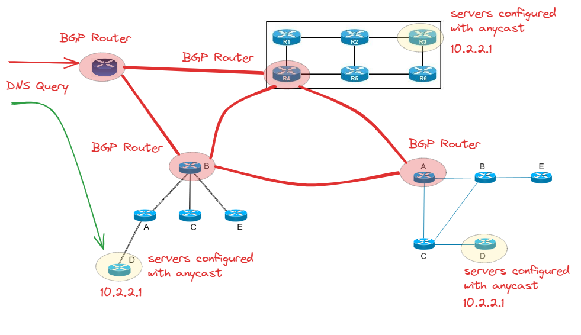

# Anycast
- Networking technique, which allows multiple machines to share the same IP address
- based on the location of the request origin the request is forwarded to the closest server (with the given IP)
- `Pros`: Increased Redundancy (`High availability`) and reduced latency (nearest node serves the response)
    - Anycast servers also do Load balancing (if multiple anycast servers are at the same same distance, then the load is spread evenly using an algorithm)
- `Cons`: Anycast routing is dependent on network topology and BGP routing tables, which are controlled by ISPs and network operators. This means that services may not always be able to control how traffic is routed to their servers.

## How any cast works
- Multiple servers advertise that they will be sharing the same IP addresses
- An autonomous-system (`AS`) is a single/collection of networks administered by the same administrator, each Autonomous system is uniquely identified by an autonomous-system-number (`ASN`)
- We configure multiple servers with the same IP address in different AS's
- when the BGP routers share the routing information each BGP router will advertise a route to reach the given IP addresses (and each machine which has the given IP will be across different networks/locations)
-  when the request arrives at a given BGP router, the DNS query will be forwarded on the Path with lowest cost (lowest distance)
- Static NAT is used to configure anycast servers (we will have to buy the anycast IP address)

