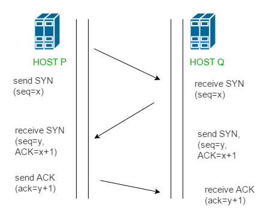

# Transmission Control Protocol
- Connection oriented protocol
- TCP breaks down the message into smaller packets (called `segment`) and sends it to the IP layer, and the packets are routed to the destination through different routes (based on connection health, congestion)
- The TCP layer waits until it gets acknowledgment for all the transmitted packets, and once all the `Segments` that were transmitted get acknowledged it sends an acknowledgment to the higher layers.
- TCP provides reliable communication because it follows `Positive Acknowledgment with Retransmission`
    - keep resending segments until ACK is received
    - If the received segment is damaged and can not be recovered (this can be checked using CRC/check-sum) then a `negative-ACK` is sent which triggers retransmission of the message
    - the segment damage is measured using the `TCP level CRC/checksum`
- TCP is a stateful Protocol, it maintains the state for data transmission between endpoints.
    - window size (endpoints tell each other how many bytes they're ready to receive) 
    - packet order (endpoints must send an ACK when they receive a packet from the other) 
    - supported options (window size, Max segment size), buffers (We are dedicating resource to the connection) `the server knows about the client state`
    - This state allows TCP to be reliable even over inherently non-reliable protocols
- As TCP maintains stateful connections we don't want to maintain these connections indefinitely, as this will waste a lot of resources to maintain the state (thus we use FIN messages to teardown the connection after the communication session ends)
- Headers tell about the TCP options supported by the host for the connection (optional features, which may or may not be used on the connection)
    - The TCP header size ranges (from 20 bytes to 60 bytes), the header size is represented by 4 bits which tell about the number of 32 bit words (4 byte words) in the header,
    -  thus header size can be ranges from  (0101 = five 32 bit words, 1111 = fifteen 32 bit words) = (5 x 4 = 20 bytes, 15 x 4 = 60 bytes)
    - as the TCP header size is limited we have limited options, thus one of the reason QUIC protocol was invented because gives more control over the protocol using option.
- Flags field tell about the message Type (SYN/ACK/ECHO/PUSH/RESET/FIN...etc)
    - only SYN and RESET messages might have ACK bit set to 0, all the other messages will have ACK set to one, as all the other messages will use non-zero ACK_NUMBERS
- The options, window size is decided based on the TCP stack (the TCP stack is decided by OS) on the device, So the min_options(SYN, SYN_ACK) will tell the actual options supported by the connection
    - Low powered devices (like IOT devices) will have a different TCP stack and the window sizes could be small
- Keep in mind, The rate at which the packets are sent must be less than rate at which received packets get consumed, to avoid choking.
- `TCP has congestion control : ` controls throughput, prevents sending of large amount of packets to a network (based on the already existing congestion in the network), as packet loss over the congested network might lead to retransmission
    - TCP does a slow start and increases throughput as the ACKs come in (it does not know about the network health and topology)

## Segmenting The message
- The message is broken down into smaller packets (called `segment`) 
- Each Segment is assigned `sequence number` before being transmitted (both at client and server)
- `acknowledgement numbers` are assigned to received ACK segments (ACK_NUM is assigned to ACK segments by the server before sending the ACK)
- For a segment (with size X bytes, and a sequence number = SEQ_NUM) being sent over the TCP connection, the ACK must have the ACK_NUM = SEQU_NUM + X indicating that X bytes have been received
    - TCP buffers all the messages sent over the TCP in a SENT_BUFFER (A QUEUE), the segment is removed from this buffer only once we receive an ACK, (if there are a lot of ACKs getting lost the app suffers from a buffer overflow)
    - We put a timer on every segment sent, if the ACK is not returned before the timer expires, then a retransmission of the segment occurs
- The TCP-option `Maximum segment size` tells the max segment size supported by the host (client/server)
    - you can not send a segment larger than the MSS, the MSS is not agreed upon (they can be different for client and server), they are just advertised

## Sequence numbers
- The `Initial Sequence Number (ISN)` shared over the `SYN` segment is usually a large random number chosen by the OS which will by the `host(client/server)` to count (`know the order of`) the segments sent over the TCP connection 
- When Responding with the ACK, the sequence number is incremented by the `host(client/server)` and sent as the `Acknowledgment Number` sending the response `(ACK_NUM = SEQ_NUM + 1)`
    - an increment of 1 signifies that `one byte` of data was acknowledged, an increment of X signifies that X bytes of data was acknowledged `(ACK_NUM = SEQ_NUM + X)`
- ACK will have SEQ_NUM + X which will tell us that the segment (with X BYTES) with given SEQ_NUM has been acknowledged, thus SEQ_NUM makes TCP reliable. 
- The Sequence number tells us if the sent message has been acknowledged or not, if an ACK comes out of order (ACK_NUM is not equal to SEQ_NUM + SEGMENT_SIZE) then a retransmission of the original packet is done, until we receive an ACK with ACK_NUM = SEQ_NUM + SEGMENT_SIZE, where SEGMENT_SIZE = size of the segment in bytes

## TCP Windows
- `ACK after every message ` will increase the number of round trips, To maintain efficiency TCP uses `Sliding Window`
- `Window size :` Controls the `throughput` of the communication, tells the `number of bytes that can be sent to the given host at a time without an acknowledgement` (usually decided on the Receive_Buffer size)
    - if the receiver window size is small then the number of round trips will increase, and all that latency will decrease the throughput. 
    - `small Receive_Buffer sizes choke the network` (buffer overflow will require Retransmission from the sender)
    - if the Receive_Buffer and window size is large then the large amount of data can be sent at once
- The TCP header only allows a maximum 65k window size (16bit field for window size), we can set a multiplier to this using the window-scale option `(options only offered during SYN in handshake)`
    - TCP options has a window-scale option that allows us to scale the window size, if the TCP window-scale is set to 3, then we multiply the window size by 2^3 = 8

    

- Window Sizes are dynamic they grow and shrink throughout the connection lifecycle (if the Receive Buffer has some un-processed data the window size gets reduced)

### Sliding Window Algorithm
- 2 Sliding windows will be present at the hosts one for the SEND_BUFFER, and one for the RECEIVE_BUFFER, Sliding window is moved either on receiving of ACK Server_APP(SEND_BUFFER) or consumption of the bytes by the Client_APP(RECEIVE_BUFFER)
- We have to make sure that the consumption rate is faster than the receive_rate
- In Selective_Repeat_Algorithm, the Receiver can accept the packets `in the window` in any order and buffer them, but when sending it to the upper layers it has to do it in order
    - thus if a packet in the window is lost all the other packets that come after it have to wait in the buffer, as we can not send the packets to upper layer out of order, and we can not move the window further than the lost packet (HOL blocking problem)
    - we can receive the ACKs of the packets in the window in any order and buffer them, but we can not move the sliding window further than the packet whose ACK got lost.

    

## 3 way hand shake for establishing a TCP connection
- To establish a TCP connection 3 segments are shared between the client and the server, this is done synchronize their states and then start communicating.
    - remember we need ACK for every segment we send over TCP, thus to synchronize their states the client sends it's state to the server and get backs an ACK and the server does the same
    - but in this case we would need 4 message `(SYN,ACK,SYN,ACK)`, to reduce the number of round trips the server sends both its `state (SYN)` and `ACK -> for clients state` in the same segment, thus we need only 3 segments (SYN, `ACK+SYN`, ACK)
    - The `Initial Sequence Number (ISN)` shared over the `SYN` segment is usually a large random number chosen by the OS which will by the `host(client/server)` to count (`know the order of`) the segments sent over the TCP connection 
- The TCP headers are shared with the SYN message that tell about the TCP options that will be used throughout the communication (`Header -> options`)
    - header size is large with the SYN/SYN_ACK as these messages only share TCP options and sequence numbers (TCP options are only exchanged in th handshake)
1. `SYN :` The client first sends the  `SYN` segment to the server, this is used to synchronize it's sequence number (share the sequence number (ISN), which will be used to start the communication with), The `ACK_NUM` here will be 0, as this is `the first packet of the communication`

    

2. `SYN + ACK : ` The server sends `ACK` for the `client SYN segment` and the server sends `SYN` and shares the sequence number(ISN) which will be used to start the communication with. 
    - here ACK_NUM = SYN_SEQ_NUM + x, and the server sequence number is also shared as a part of server_SYN

    

3. `ACK : ` The client sends the ACK for the segment received from the server

    

- We get to know a the following information from just the SYN, SYN+ACK round trip
    - The host we are trying to connect to `exists and has enough resources` (free port, memory, etc) to establish a connection 
    - There exists a `route over the network to reach the host`, and the RTT `(round trip time)` to send a segment and receive an ACK, and the number of hops required to get to the host (using TTL)
    - The TTL usually starts with 64/128/255, and is decremented with every hop (it is a part of the TCP header) we can subtract it from the usual initial values and get to know the number of hops

### Useful Links
- https://www.youtube.com/watch?v=rmFX1V49K8U&list=PLW8bTPfXNGdAZIKv-y9v_XLXtEqrPtntm