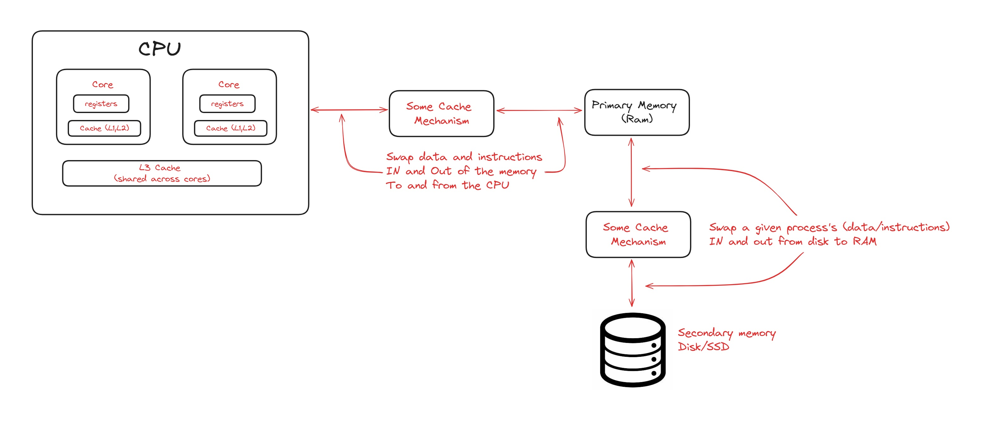
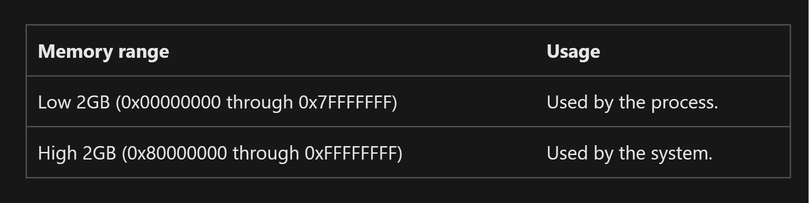

# Memory Management
- functionality which manages `primary memory` (movement of processes back and forth between primary memory and disk), it also manages other memory resources like (Registers, Primary memory, Disk)

    

- For a program to execute, we load the program from the disk on to the primary memory, and the instructions/data is loaded one by one into the CPU (caches store frequently accessed data/instructions to speed things ups) 
- A program becomes a process when loaded on to the main memory (`Multiprogramming` : The operating system greedily tries to load as many processes as possible onto the main memory from the disk)
    - `degree of multiprogramming` : max number of processes a that a single processor can accommodate efficiently (in a concurrent manner)
- `Memory Management service`: in the OS keeps track of each and every memory location (both free and allocated), determines which process will be allocated how much memory and for how long, it updates the status of the memory, whenever it gets freed(event driven)

### What is the need of swapping the processes IN/OUT of the memory
- A process can either use CPU or wait for I/O, but when waiting for I/O the `CPU becomes idle`, we need to `swap a different process into the main memory` or `give time to some other process` in the memory in such case
    - Swapping of processes IN/OUT of the main memory (`Context Switch`) is an overhead on the system, this overhead can be reduced by loading more processes on to the main memory (increase the degree of multi programming => keep more processes in ready state inside the main memory) 

### Memory Addresses
- `The process (virtual) address space : ` is the set of `logical addresses` that a process references in its code. 
    - For example, when 32-bit addressing is in use, addresses can range from `0` to `0x7fffffff`; that is, (`2^31 - 1`) possible numbers, for a total theoretical size of 2 gigabytes. (we partition the memory address space with 32bits into 2 equal partitions (of size 2^31 each), the first bit is used to denote the partition number)
    - each memory address will store a byte of information (8 bits), if the memory is `word-aligned` then we access the memory in terms of words (2 bytes/2 memory location/16 bit word size) 
    - The `virtual address space` for 32-bit Windows is 4 gigabytes (GB) in size and divided into two partitions: one for use by the process and the other reserved for use by the system. (the MSB indicates the partition)
    - The partition size is usually 2GBs each, but can be modified

    

- The Operating system manages the mapping of virtual memory addresses to physical memory address at the time of memory allocation.

### Address Types
1. `Symbolic address` : variable names, constants and instruction labels (address used in source code)
2. `Relative Addresses` : as the name suggests, they are `offset-addresses` relative to the `programs starting point`, relative addresses are converted into virtual addresses at compile time, by adding the base address
    - for example if the program starts at `0x04000000` and the relative address is `0x00000100` then the virtual address becomes `0x04000100`
3. `Physical Addresses` : the loader generates these addresses from the virtual addresses when the program is loaded on to the main memory

### Paging (Non contiguous memory allocation)
- Split the process into smaller blocks called as pages, and place these blocks at different places in the main memory (need not be contiguous)
- the memory locations on the RAM get freed and allocated at random thus analysing the free spaces, splitting the processes into smaller blocks and assigning these blocks to the free memory locations dynamically is a costly operation
- the free spaces for such blocks at the RAM are called `Frames`.
- Thus Rather than splitting the process on demand, we store the `partitioned version of the program` in the disk, the program is partitioned into small blocks called `pages`.
> Remember! `Page Size == Frame Size`

### Address Mapping
- the set of all logical addresses generated by a program is it's `logical address space`, and the set of all the physical address corresponding to these logical addresses is the `physical address space`
- virtual and physical addresses are same during the compile and load-time, they differ only during the execution time

### Streams vs Buffers vs Arrays