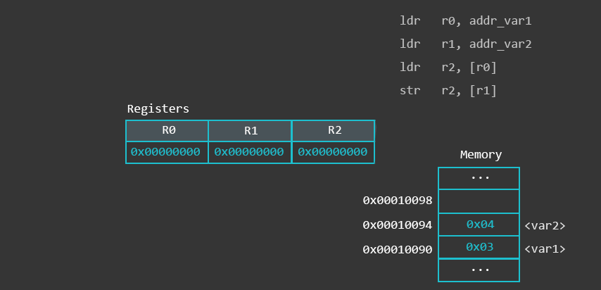
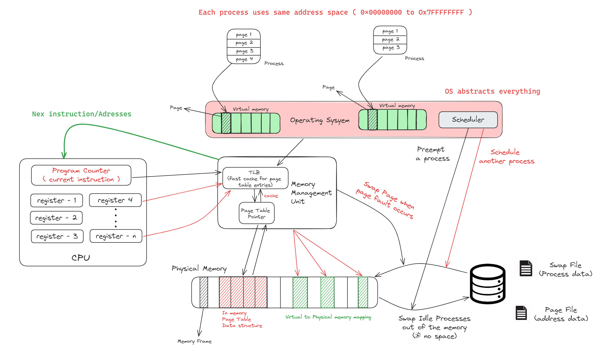
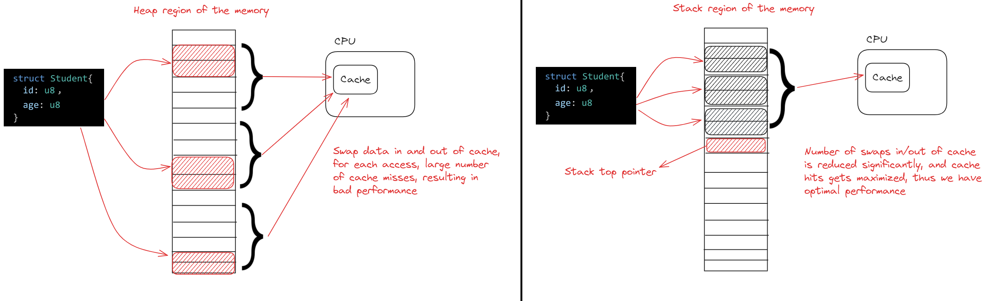

# Memory Management
- functionality which manages `primary memory` (movement of processes back and forth between primary memory and disk), it also manages other memory resources like (Registers, Primary memory, Disk)

    

- For a program to execute, we load the program from the disk on to the primary memory, and the instructions/data is loaded one by one into the CPU (caches store frequently accessed data/instructions to speed things ups) 
- A program becomes a process when loaded on to the main memory (`Multiprogramming` : The operating system greedily tries to load as many processes as possible onto the main memory from the disk)
    - `degree of multiprogramming` : max number of processes a that a single processor can accommodate efficiently (in a concurrent manner)
- `Memory Management service`: in the OS keeps track of each and every memory location (both free and allocated), determines which process will be allocated how much memory and for how long, it updates the status of the memory, whenever it gets freed(event driven)

### FAQ
- `Addressing : ` to address 4GB memory we need (4 * 10 ^ 9) * 32 bit unique numbers, that is (4 giga * 4 bytes) = `16 gigabytes`, storing every address in memory is crazy, each variable is mapped to one memory address, (in case of iterables we load this initial address on to the register, and keep incrementing to get the successive location)
    - in case of a random access like linked list, each node is of the size `[data size + address size]` (address size : 4 byte long )
    - So the number of addresses we store is approximately proportional to number of variables in the program (and on the data structures being used) all this is stored in the virtual memory

    

### What is the need of swapping the processes IN/OUT of the memory
- A process can either use CPU or wait for I/O, but when waiting for I/O the `CPU becomes idle`, we need to `swap a different process into the main memory` or `give time to some other process` in the memory in such case
    - Swapping of processes IN/OUT of the main memory is an overhead on the system, this overhead can be reduced by loading more processes on to the main memory (increase the degree of multi programming => keep more processes in ready state inside the main memory)

### How are programs allocated Memory Addresses
- `The process (virtual) address space : ` is the set of `logical addresses` that a processes reference in their code. 
    - For example, when 32-bit addressing is in use (we partition the memory address space with 32bits into 2 equal partitions (of size 2^31 each), the first bit is used to denote the partition number), addresses can range from `0` to `0x7fffffff` and `0x80000000` to ``0xFFFFFFFF`; that is, (`2^31 - 1`) possible numbers, for a total theoretical size of 2 gigabytes per partition.
    - each memory address will store a byte of information (8 bits), if the memory is `word-aligned` then we access the memory in terms of words (2 bytes/2 memory location/16 bit word size) 
    - The `virtual address space` for 32-bit Windows is 4 gigabytes (GB) in size and divided into two partitions: one for use by the processes and the other reserved for use by the system (Kernel/OS). (the MSB indicates the partition)
    - The partition size is usually 2GBs each, but can be modified

    

- `How processes get allocated on the memory`: When a program starts running it can not store its data anywhere in the memory, as other processes might already be using it
    - the operating system knows which processes are running in which part of the physical memory, the Operating system has an abstraction  over the physical memory called virtual memory, the processes get allocated on the virtual memory, and each process gets it's own virtual/process address space.
    - the memory allocated on the virtual memory is then mapped to the physical memory (mapping is done by the memory management unit, and the mapping information is stored in an `in-memory data-structure` called `Page-Table`, there is also a  )
    - TLB (`Translation Look aside buffer`) : cache used to optimize page table look ups, TLB sits on faster proprietary hardware, but this hardware has minimal storage space (usually 12 bit addressing 4096 bytes)
    - when process starts running, it makes a system call to get a chunk (on the physical memory) where it can read from and write to. (if we try to read/write outside this chunk, which might be used by other processes, we get a `segmentation fault (core dumped)`)
    - as this chunk is small, we must store the data in an organized way, or else we can end up with a lot of wasted space (fragmentation: usually external fragmentation)
    - requesting memory chunks is expensive (blocking call)

> Internal fragmentation is usually avoided as we break the process into sufficiently small chunks called pages, and page size is equal to the frame size on the physical memory

### How OS abstracts out memory management
- each process is alloted a `virtual memory` (each process thinks it is the only process running on the ram)
    - the virtual address space can be larger than the physical memory, each process uses similar virtual address space (0x00000000 to 0x7FFFFFFF), 2 or more processes can use the same virtual address but they will be mapped to different memory-location/disk-swap-file based on the processes' page table
    - each process has a page table (the page table can be stored on the disk if the it is not in use), the `Page Table` is an `in-memory data structure` (page table translates the virtual addresses to the physical addresses)
    - `Memory management unit (MMU)` is a piece of hardware that sits on the CPU (like ALU), it has the address of the in memory page table, and a TLB (translation Look aside buffer), TLB is a fast cache storage hardware (can store up to 12 bits of addresses 4KB) TLB caches recently used translations
    - The virtual memory is stored in 2 files on the disk
        - `page file : ` stores all the pages tables not being used at the moment (if a there is a page fault (`cache miss`) at the `in memory page table`, appropriate page table is swapped in to the memory, from the page file)
            - Page tables: store all the memory mappings from the processes virtual address space (get swapped in and out based on the pages being addressed)
        - `Swap file : ` stores all the process data (code, data, open files, stack, registers and program counter), they get swapped in and out based on process state (decided by the process state) 

    

### Address Types
1. `Symbolic address` : variable names, constants and instruction labels (address used in source code)
2. `Relative Addresses` : as the name suggests, they are `offset-addresses` relative to the `programs starting point`, relative addresses are converted into virtual addresses at compile time, by adding the base address
    - for example if the program starts at `0x04000000` and the relative address is `0x00000100` then the virtual address becomes `0x04000100`
3. `Physical Addresses` : the loader generates these addresses from the virtual addresses when the program is loaded on to the main memory

### Paging (Non contiguous memory allocation)
- Split the process into smaller blocks called as pages, and place these blocks at different places in the main memory (need not be contiguous)
- the memory locations on the RAM get freed and allocated at random thus analyzing the free spaces, splitting the processes into smaller blocks and assigning these blocks to the free memory locations dynamically is a costly operation
- the free spaces for such blocks at the RAM are called `Frames`.
- Rather than splitting the process on demand, we store the `partitioned version of the program` in the disk, the program is partitioned into small blocks called `pages`.
> Remember! `Page Size == Frame Size`

### Address Mapping
- the set of all logical addresses generated by a program is it's `logical address space`, and the set of all the physical address corresponding to these logical addresses is the `physical address space`
- virtual and physical addresses are same during the compile and load-time, they differ only during the execution time

## Optimizing memory lookup
A given process has a stack memory (data-structures are stored closely in adjacent memory locations, and the program has the base address and the type (offset from base) to read the data structure from the memory)
- `How we cache data at the processor`: the Processor has 3 levels of cache (L1, L2, L3), and theses caches store blocks of contiguous memory locations from the memory, the cache efficiency is decided based on the number of cache hits.
- Storing the which is accessed in quick succession, closely will improve the number of cache hits, thus using stack to store data structures which are accessed in succession will optimize the performance of out application (`because in stack we store the data structures adjacent to each other`)

    

- `Limitations of the Stack region in memory : ` the stack can grow only up to a certain size, thus we can only store data-structure whose size is known at compile time, if this size is more than the stack can offer, we get a stack-overflow run time error
    - The stack region of the memory is also used to execute functions too (`recursion can cause stack-overflow error, if the recursion depth is substantial large`) (`we keep popping the stack frames (reset stack pointer to the return link), after we reach the max depth`)
    - Only arrays/strings/maps/graphs and other Data-structures, with known size can be allocated on the stack

## Pages, Frames and Page table
- segmented/paged memory : 

### Fragmentation

## Resources
- https://www.youtube.com/watch?v=N3o5yHYLviQ

### Streams vs Buffers vs Arrays