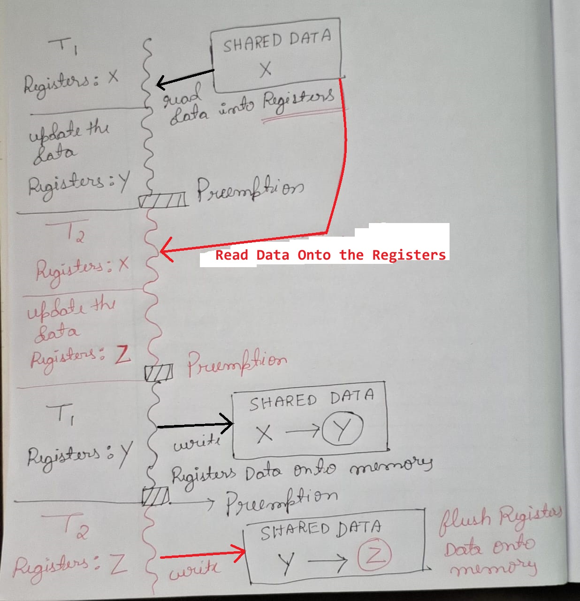

# Multi threading
- Threads allows us to execute multiple separate control flows at the same time (share the same code and data), threads are also called light weight processes, each process will have at least one thread called the `main thread` and we can have multiple `worker threads`
- `When to use threads :` we use threads to speed up compute intensive tasks, and avoid blocking other operations due to the compute intensive task.

## Sequential vs concurrent execution
- `Concurrency : ` multiple tasks are carried out at once, some times tasks have to wait on shared resources, interleaving of tasks by the processor (Order matters when synchronously operating on shared resource)
    - `Example:` Move Processes waiting on I/O, network requests,...etc out of the CPU, and give the CPU resources to other processes
    - Each Process/Thread gets bursts/slices of CPU time based on the scheduling algorithm
    - ( virtually appears to be parallel, but actually the threads run on the same core and the processor keeps switching the context rapidly )
    - usually done so that some important operations such as  user I/O doesn’t get blocked to maintain interactivity
- Parallelism : Everything happens at once simultaneously, the threads run on separate cores.

## Threads and Process

## Brief Overview of Process and thread scheduling

## Things to keep in mind when working with threads
- We need to make the main thread wait for the completion (joins) of the worker threads, if the main thread completes its execution it returns and closes the process, (the process could get closed even when one of the peer thread hasn't finished executing)
- Threads are non copyable
- It's easy to forget to join the threads, and wait on the threads to complete execution in the main thread. this could lead to unforeseen issues with the code, thus making it hard to investigate for bugs in code.
    - To avoid such issues we can use self joining threads, the main thread automatically waits for such threads to complete execution, before main thread stops its execution 
    - in C++ we have `std::jthread` which automatically makes the main thread wait for the worker threads execution to complete, the `thread.join() method` is called in the `jthread` objects destructor.


### Spinning up multiple Threads
- When spinning up multiple threads in a loop, if we join a thread before spinning up another thread then the main thread waits for the other threads threads execution to end before starting up a new thread, thus the execution becomes non-parallel/synchronous
```C++
// synchronous execution issue when spinning up multiple threads
for(int i = 0; i < threadCount; i++)
{
    threads.push_back(std::thread(&function, param)); // create thread

    // wait synchronously for current thread execution to end before creating new thread
    threads[i].join(); 
}

/**
  *-----------------------------------------------------------------------------
  * Fix : parallel execution when spinning up multiple threads
  *-----------------------------------------------------------------------------
  */
for(int i = 0; i < threadCount; i++)
{
    threads.push_back(std::thread(&function, param)); // create threads, and execute in parallel
}
for(int i = 0; i < threadCount; i++)
{
    /**
      * wait for thread executions to end
      * all the threads are running in parellel
      */
    threads[i].join(); 
}
```
<p align="center" float="left">
    
    <div style="width: 10px;"></div> 
    
</p>

---
# Pitfalls when using concurrency
1. Data inconsistency due to race condition
2. Deadlocks (when using mutex locks)

## Preventing inconsistency when shared data is accessed concurrently
- `Race Condition : ` when 2 threads try to update the shared resource concurrently, they race to end their execution last, the thread that completes execution last is responsible for the final value of the shared resource
- `Preemption is stochastic(random)`, if 2 operations are run in parallel, less number of times, it is less likely for the thread to get preempted in the critical section and cause issues. if 2 threads lun long ops in parallel then they are more likely to get preempted in the critical section.
- `The following situation causes a race condition to occur : ` assume Shared Data = X
    - A thread `reads the shared data onto the registers` and is preempted mid way when the data is being updated in the registers, thread readd Shared Data = X onto the register and updates it to Y in the register, the thread gets preempted before storing the data back to the memory.
    - Followed by another thread reading the shared data (X) onto the register and gets preempted midway when it updates the data in the registers(Z). the thread gets preempted before writing the data onto the memory.
    - Now which ever thread flushes its data in the register to the memory last will be responsible for the final state of the shared data
<div style="text-align: center;">
    
</div>

- To prevent Race conditions from happening we can acquire Mutually exclusive locks (mutex locks) on the shared resource when updating the shared resource.
    - Mutex locks prevent other threads from accessing the shared resource when a given thread is modifying the shared resource (`The lock data is shared across the threads`), The other threads wait until the lock is released
    - When a thread acquires a lock on shared resource and gets preempted, the other threads wont be able to access the resource as the resource is locked, they just wait indefinitely until the lock is released

<div style="text-align: center;">
    
</div>

> Look into the following files to know more about mutex locks `./Code/BasicMutex`

- in `C++` we can prevent preemption of the operation by creating an `atomic variable std::atomic<Type T>`, the operations on such variable will always be atomic and no preemption/interleaving of thread occurs during the operation, remember we can use only primitive types and a few operators, when using atomic wrapper (overloads a few operators)
- We can extend the atomic wrapper, to wrap around our own object, given that the object can be represented as collection of bits, and the operation is a simple bitwise operation on the bit (because hardware supports only atomic bitwise operations)

---
## Mutex overhead (overcoming this overhead using Condition variable)
- Usually when a thread acquires a lock, the other threads wait indefinitely and keep polling to check if the lock has been released
- The polling wastes a lost of computation, by continuously checking if the lock has been released or not
- The threads get interleaved, one thread performs operation on shared resource and the other threads keeps polling indefinitely (which wastes a lot of compute)

<div style="text-align: center;">
    
</div>

- `Condition Variable : ` can be used to block a thread/multiple thread at the same time (we basically make a set of threads sleep)
    - The condition variable blocks the threads (makes the thread sleep), until one thread (that is operating in the critical section) modifies the shared variable (condition) and notifies the condition variable
    - once the condition variable is notified, one of the threads is notified and is woken up and it starts operating on the critical section (acquires lock)
    - to use condition variable we need 3 things `Lock`, `Condition Variable` and a `boolean` to check if the thread has completed execution
- A thread in sleep state never gets CPU time, thus time is not wasted in unnecessary polling

<div style="text-align: center;">
    
</div>

```C++
// global variables shared variables
std::mutex gLock;
std::condition_variable gConditionVariable;
int result = 0;
bool completionNotifier = false;

// threads
std::thread reportingThread = std::thread([&]{
    std::unique_lock<std::mutex> uniqueLock(gLock); // acquire lock
    if(!completionNotifier)
    {
        // we will come here only during thread initialization
        // the thread is put into sleep state after initialization, until the worker thread updates the result
        gConditionVariable.wait(); 
    }
    // automatic lock release
});
std::thread workerThread = std::thread([&]{
    std::unique_lock<std::mutex> uniqueLock(gLock);
    result = longOperation(); // update the shared variable
    completionNotifier = true;
    gConditionVariable.notify_one();
    // automatic lock release
});
reportingThread.join();
workingThread.join();
```

---

## Preventing Deadlocks when accessing shared resources and using mutex locks
- A `Deadlock` as the name suggest, a lock on a shared resource which is never released (Dead), there by making other threads wait indefinitely on the shared resource
    - Usually deadlocks happen when there is circular wait (dependency), 
    - or when an exception is thrown and the thread execution is terminated without releasing the lock
- In case when an exception causes thread termination without releasing of the lock, A lock guard can be used
    - lock guard is a wrapper (RAII style mechanism) around a mutex, which releases the lock when its destructor is called (even when an exception is thrown)

```C++
void threadSafeOperation(int x)
{
    mutexLock.lock();
    updateSharedResource() // an exception can occur during the operation
    // if an exception occurs the thread terminates 
    // and lock is never released causing deadlock
    mutexLock.unlock()
}
/**
 * Use lock guard to avoid the above mentioned issue
 * lock guard automatically releases the lock when thread terminates
 */
void threadSafeOperation(int x)
{
    std::lock_guard<std::mutex> lockGuard(mutexLock);
    updateSharedResource() // an exception can occur during the operation
    // even if there is an exception the lockGuard destructor is called
    // when the function goes out of scope, as it is stack allocated
}

```
### Preventing Circular wait deadlocks
- Circular wait deadlock occurs when threads have a circular dependency in shared resources, when releasing locks, thus the locks are never released and threads keep waiting
    - In the given example T1 has a lock on R2 and waits to acquire lock on R1. The thread T2 has a lock on R1 and waits to acquire a lock on R2, but both R1 and R2 already are locked and the threads wait indefinitely
- When a program gets stuck in such dead lock there is no graceful way to come out of it, only way is to kill the program/thread. a few possible ways to fix the dead locks are as follows
    - kill one of the threads and break circular dependency (priority => old/new/least busy/most busy)
    - restart process (inconsistencies)

<div style="text-align: center;">
    
</div>

- The most graceful fix to such situation is to prevent the process from entering into a deadlock (prevent circular dependency), circular dependency can be avoided as follows
    - maintain a resource allocation graph, and every time a thread wants to acquire some resource check if it forms a cycle in the graph (check for circular dependency), `block such thread from acquiring lock until there is no circular dependency` (or we can kill the thread that holds the least/most number of locks based on problem context)
    - this check for cycle will take O(N)? (Disjoint Sets to speed up)

### Best way to write deadlock free code
- Deadlocks happens because threads are waiting on resource held by other threads (circular dependency), out of order acquiring of resource (the locks can be acquired in any random order, forming deadlock)
    - cyclic dependency occurs because of the locks getting acquired in random order
- thus deadlock can be avoided by forcing all threads to acquire the locks on resource in the same order
- Core Idea: make all the threads acquire locks on the resources in some `total order` (ra, rb, rc ...) where a > b > c, without acquiring locks on resource `r[i]` the thread can not acquire lock on the resource `r[i+1]`
- but total order in acquiring locks can not be ensured in all the applications (like data base transaction), thus this solution can be applied only in few situations

<div style="text-align: center;">
    
</div>

### Why ordered access always result in deadlock free code
- lets assume the most simple case where 2 threads T1 and T2 want the resources R1 and R2
    - consider that T1 acquires lock on R1, in this case T2 cannot acquire lock on Any of the resources (unless T1 releases lock on R1, as T2 can not go out of order and access R2), thus dead lock is avoided
    - if order wasn't imposed T1 would have acquired lock on R1, and T2 would have acquired lock on R2, then T1 and T2 would have waited indefinitely to acquire locks on the resource held by each other (T1 wants R2 held by T2, T2 wants R1 held by T1), causing a dead lock
- if a thread is on Resource `R[i]`, that means that it has already acquired locks on the threads `(R[0]....R[i-1])`, and all the other threads who want the resource which are a subset of `(R[0].....R[i-1])` will have to wait till the locks are released, and cannot access resource after `R[i]` out of order.
    - Dead locks occur only when `both the threads wait`, this is because one of the threads has locks on resources before `R[i]` and wants lock on resource after `R[i]`, and other thread has lock on resource after `R[i]` and wants lock on `resources which are subset of resources held by other thread` before `R[i]`
    - in total ordering this is never possible, and only one thread waits (because it can not access the resource after `R[i]` out of order, before the other thread releases the locks on resources before `R[i]`)
    - basically we are avoiding a situation where  T2 waits on a resource before `R[i]` held by T1 and acquires a resource out of order after `R[i]`, which is needed by T1 (causing both threads to wait, as they need both resources to complete operation and release locks)
    - there by never causing circular dependency

<div style="text-align: center;">
    
</div>

> look at `./code/CircularWaitCode/` for the total order deadlock avoidance technique

---

## Creating a single threaded event loop based system using async

