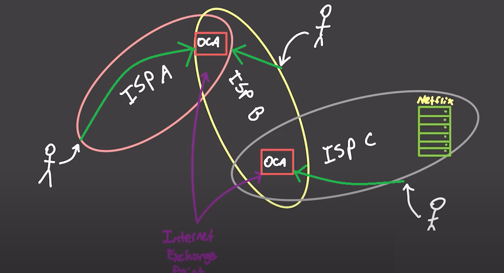
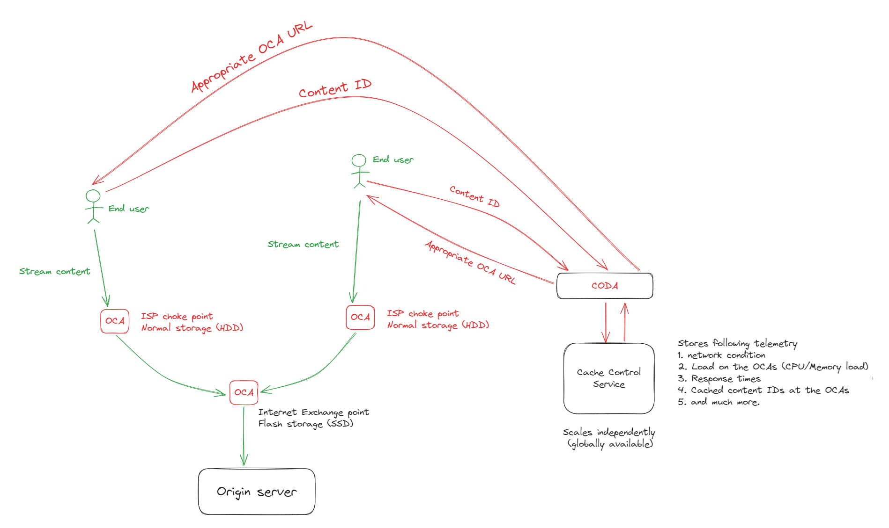

# NetFlix CDN
- Internet service providers are connected over large distances (some ISPs are only responsible for connecting ISPs across continents), and passing data over such large distances is expensive
    - sometimes the traffic may need to move from on ISPs network to another (and this might increase latency), these points where 2 ISP networks interact are called Internet Exchange points
    - the bottlenecks in this case is transmission of the data across the Internet exchange points

    

- to overcome these bottlenecks and fast storage needs (as most of the content at the CDN is high res video data), netflix hav come up with their proprietary CDN POP appliances called OCA (Open Connect Appliances), these point of presence (POP) appliances are deployed at the Internet exchange points (which fixes the bottleneck issue)
    - As Multiple ISPs can easily communicate at the (`internet exchange`)IE points directly without hopping to a different ISP, deploying POP servers at the IE points maximizes the number of direct Unique ISP connections the given POP can have
    - most of the requests served by netflix is static content requests, thus The OCAs reduce load on the netflix servers and `ISP infra` as a whole. The number of requests served by the netflix origin will be minimal, as the OCAs handle all the static content requests (the request ends up at the origin server only on the initial request when the OCA does not have requested static content, the subsequent requests are served from the OCAs cache)
    - Netflix allows the ISPs to deploy these OCAs anywhere in the network (at the network choke points), to further reduce load on the ISP infra and reduce streaming latency. 3 tiers provided for cost (standard: `normal HDDs used at non IE choke points`, Flash: `SSDs and faster storage  usually used at IE points`, global: `cheap hardware used by less developed regions (most cheap)`)

    

## Hierarchical design
- the OCAs at the ISP choke points do not directly request the static content from the origin servers, instead they request the content from the OCAs at the IE points, this further reduces load on the origin server (the IE point OCAs will use SSD storage as they will be requested for content regularly)
- `The Cache control microservice`: netflix has developed a `cache control` microservice (Globally available/scales independently) which stores the telemetry about (network condition, load on the OCA node, response times), based on these factors the `CODA` micro service decides on which OCA should the user use based on the requested content ID and user geo-location.

    

