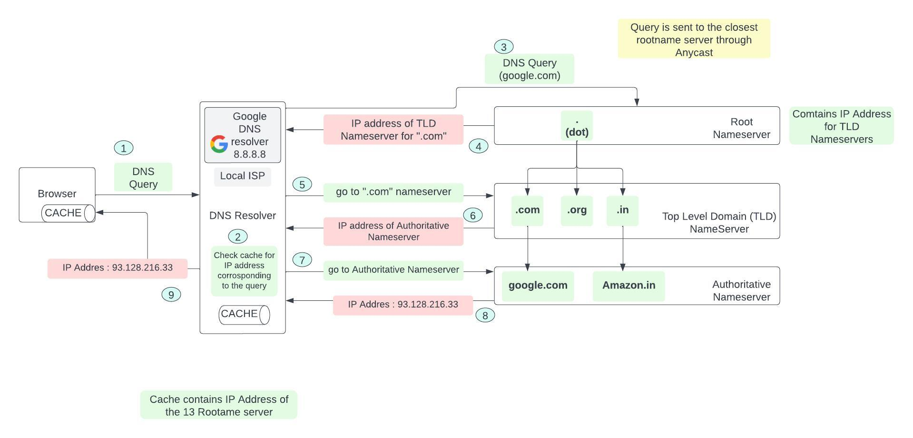
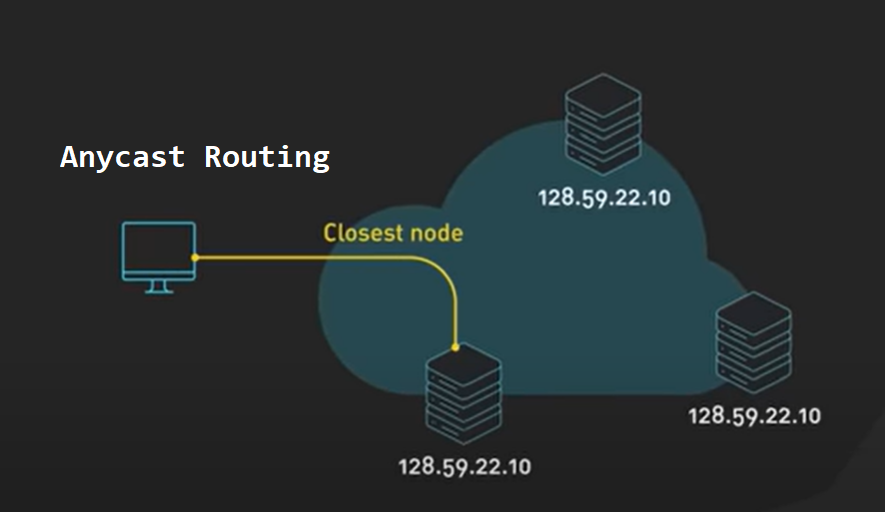
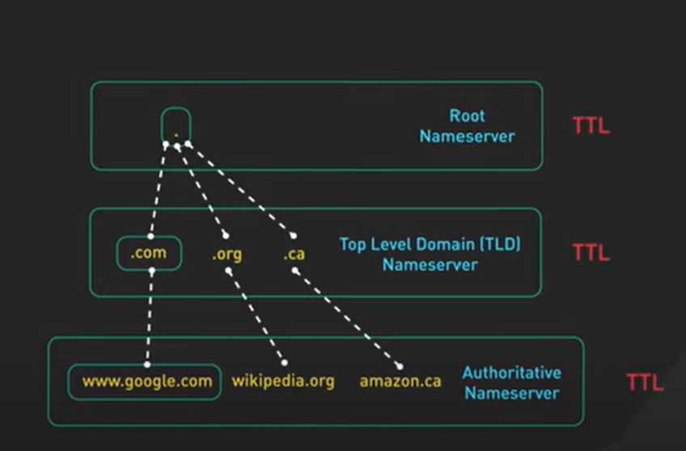

# DNS 

- there are 13 logical `Root Nameservers`
- many physical servers behind each of the `13 IP Addresses`
- If the DNS resolvers doesnt have the corresponding IP Address for a particular query, it  sends the DNS query to the closest Root Nameserver using `Anycast`

- Root Nameservers foreward the query to a `Top level domain (TLD) Nameserver`
- TLD Nameservers have the IP Addresses of all the `Authoritative Nameservers` for all domains under them
- Authoritative Nameservers provide an **authoritative answer (final answer)** to a dns query
- When we register a domain name we register it with one of the Authoritative Nameservers
- The hierarchical design makes DNS highly decentralized and robust
- DNS propogation is slow because there is a `TTL` on each record, thus we will have to wait for the TTL to expire before making any updates, hence when creating new records keep small TTL

- Some of the DNS servers are buggy and take some time to get updated, hence decomissioning a server might cause the incoming requests to be redirected to the wrong ( old IP address ), hence decomisson a server only when the incoming traffic is sufficiently low

