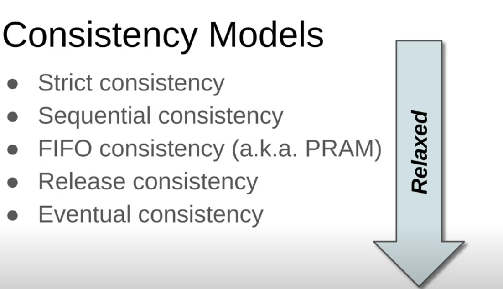
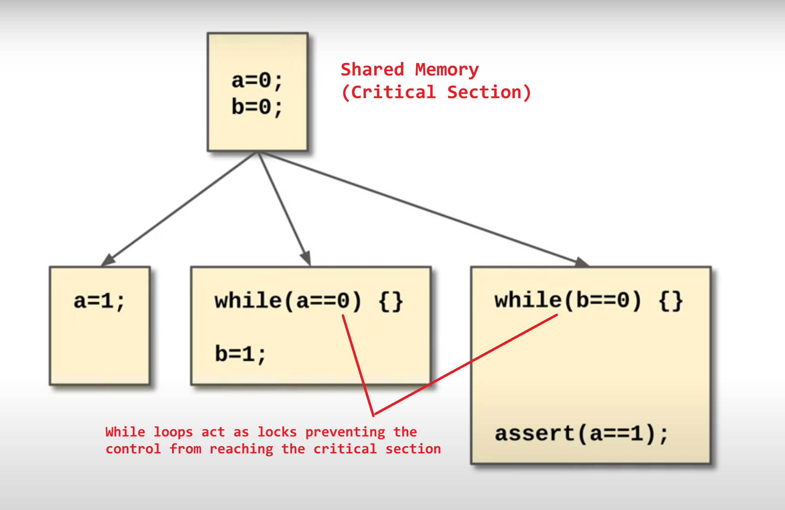
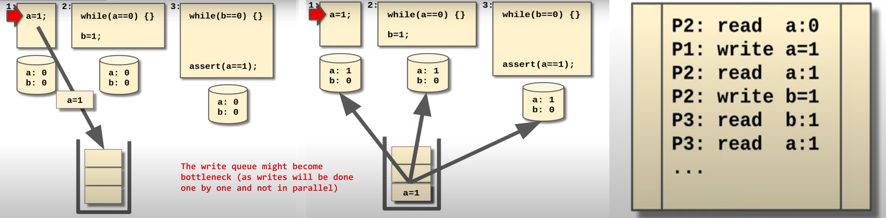
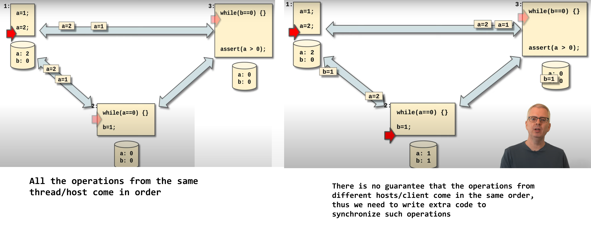

# Consistency Patterns
- distributed systems are networked, and the systems communicate by sending messages (packets) across the network
- `Consistency models` decide the rules for the operations that can run in parallel, and the strategy to merge the results of those operations
following are 2 levels of consistency
    - `Strong consistency : ` after a write is made all the subsequent reads will always receive the latest updated data (synchronous write propagation, can be  done using locks)
    - `Weak consistency : ` after a write is made all the subsequent reads may/may not receive the latest updated data (asynchronous write propagation can be done using queues)
### Things to note when reading the following section
- the threads being mentioned here could be in the same process or `processes across servers` (then `shared memory` in this case would be a `distributed cache or a Database service` the threads use to store their data)
- the `red pointers` indicate the flow of control is during the execution

    

## Strict Consistency
- All writes are instantly visible to all subsequent reads 
- consider that there are multiple reader and writer threads, competing for the CPU time, at a given instance of time only one thread can run on the CPU, assume that the threads share the same memory
- some variable/object will be used to synchronize the threads (synchronization decides the order in which the threads execute)
- The shared memory (critical section) must be mutually exclusive (only one thread can enter the critical section at a time)
- Atomic operations : operations that will be either completely executed or not executed at all. atomic operations can not be partially executed (atomic operations can not be interrupted midway)
- Only one thread (producer) can write to and read from the shared memory at a time, when writing/reading to the shared memory, the thread acquires a lock (the acquiring of lock is an atomic operation), and the other threads can not enter the critical section when one of the threads is writing to the shared memory
- blocking other threads from writing/reading, will cause loss of CPU time, This method works fine only in high frequency operations (in this case thread context switches occur at very high frequencies)
- employing this method in case of comparatively slower concurrent operations might cause a bad user experience as one of the producers remain blocked while other producer is writing  (example: users collaborating on a document, users commenting at the same time)

    

## Sequential Consistency
- Superset of Strict consistency, each thread/client has their own cache (copy of the shared resource), all the write operations go to a write queue and are broadcasted to all the threads/clients that have subscribed to this value, which then update their caches accordingly
- Follows a PUB/SUB model (Consumer threads subscribe to the write events) and a queue is maintained which holds all the write operations in a `Sequence`, A `log` is also maintained which stores all the writes/read operations in sequence of the order in which they occurred
- Every thread is sequentially consistent (appears to follow `the same sequential ordering for writes`), in databases this concept is called `serializability`
- Used in multiprocessor computers, all writes are sent over the same `shared BUS` (the bus acts as the broadcasting write queue)
- Can be used with distributed systems with one controller process that controls all the and writes (usually used with applications where the reads exceed the number of writes)
- Sequential consistency allows parallel reads (reads happen at the local cache), there by improving the speed of the read operation
- the sequential nature writes might become bottleneck for the system 
- ensuring atomicity (reverting the write in case of failure) is `complex`

    

## FIFO Consistency
- Each thread/client has its own cache, but the clients use `point to point links` instead of broadcast to propagate writes
- Each operation is propagated to all the connected clients in the order they where performed at the given host/client (this `in order` nature gives this pattern it's name `FIFO`)
- `Updates from the same host/clients get applied in order`, but in case of updates from different clients there is no guarantee of proper  ordering
- To handle the updates that might come out of order from multiple clients (as there is no guarantee that writes from different clients will come in order), we need to write extra code (`Operational Transform`)
- No central write queue bottleneck (like in sequential consistency), needs more programming, n^2 scaling of number of message
    - we can solve this issue by using in-order multicast (one channel to share one message with multiple clients,)
- same order of operation from the same process, but operations from different processes may interleave differently on each node.

    

## Release Consistency
- Use the Primitive Locks with FIFO consistency, and only propagate the `write operations` that occur between the acquisition and release of the lock (we only propagate events concerned with the critical section), basically squash/merge all events into a bulk event and transmit to decrease number of messages sent over the network
    - basically if there is a lot of change instead of sending all the operations we just send the `diff` that occurred between acquiring and releasing the lock
- `the locks can not be acquired until the inbound messages are processed and local cache is updated`, 
- processes use a distributed lock (this ensure the `other/remote` process can not enter the critical section without processing the updates sent by the given client)
- as we are using distributed locks, we will end up sending control messages about the locks (but this overhead is nothing compared to the transmission of multiple events)
- used in file-systems like google drive and drop box (File content is re-downloaded if the cache is stale)
    - update file on file close (auto save on lock release)
    - download the file on open (auto download on lock acquire)

## Eventual Consistency
- The system converges to a consistent state after finite amount of time, (when everyone stops performing writes, we are sure that at some point the writes will stop coming and system will become consistent)
- Example : cross DC propagation of updates in a sharded/partitioned database (The diffs get propagated and merged eventually and everyone sees the same consistent view eventually) 
- only used when the data will be used by humans (as we have tolerance to some amount of inconsistency)
- APP Examples : Social media comments/posts

