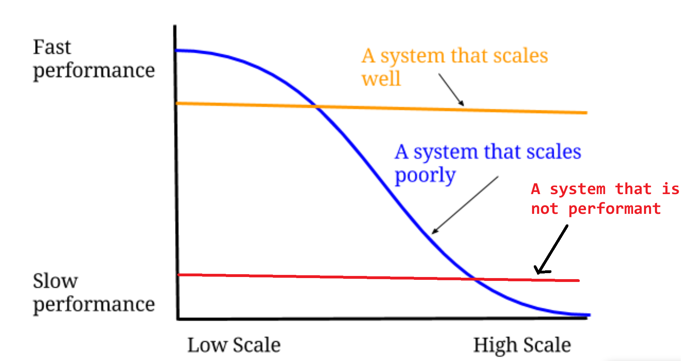
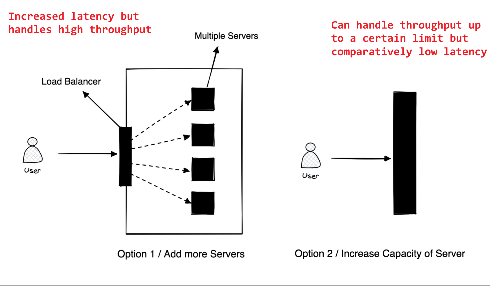

# Basic Concepts

## Performance vs Scalability
- Performance is concerned with a single unit of work done (processing single request, performing single operation)
- Scalability (is concerned with load) is concerned with the amount of work/requests the service can handle gracefully (To Scale a service we use a distributed system where we will have multiple replicas of the service and the work gets distributed to these replicas)
    - A service is said to be scalable, if the increase in the available resources increases its performance
- A service is scalable if the improve in performance is directly proportional to the resource available (`scalability cannot be an after-thought. It requires applications and platforms to be designed with scaling in mind,`)
- A service is performant if it has `good time-complexity`
- Examples : 
    - A service might be performant but can not scale well (handles requests gracefully for a certain threshold, but as the load increases the time consumed will increase), `in this case the either the number of nodes is insufficient` or `the work is not getting distributed among the nodes properly` or `the service architecture does not support scaling`
    - A service might scale well but might not be performant, (over consumption of resources when handling small number of requests, but can handle large number of requests), `in this case the time complexity of the operations performed is more`
    - A service might be both performant and scale well

    

## Latency vs Throughput
- Latency: time required by the system to respond to a request
    - High latency can be caused due to multiple reasons (inefficient code, network congestion, more network hops, Load on the resources)

- Throughput: amount of requests the system can handle at the same time (the rate of requests that a system can handle)
    - `Example : ` Databases are low throughput systems, we can make perform `bulk read/write operation` in a `low-latency` manner, but a large number of operations coming at a high rate would slow the database down (`multiple disk I/O operations will be the bottle neck`)
    - measured as requests/transactions/bits per second
    - Low Throughput can be caused due to (`High latency services`, CPU/Memory capacity) 
- We need to find the right balance between Latency and Throughput when building our distributed system
    - If we increase throughput (serve more requests), we will end up using more resources and might need to scale-out horizontally (there by using more network calls) causing the latency to go up
    - We can scale-up vertically and keep the balance between throughput and latency (but there is a limit on the amount of scale that can be achieved vertically, and eventually we might end-up scaling horizontally)

    

- Databases: we can use `in-memory` cache to cache frequently queried data, but this limits the throughput as the `memory size is limited`

---

## Basic over view of a distributed system
- optimize process and increase the throughput using the same resources (Vertical scaling/ optimizing data-structures)
- get more machines to get more processing power
- Preprocessing and cron jobs ( handle all the non )
- Utilize Failover and have backups to make the system resilient and fault tolerant
- `Microservice Architecture : ` Decouple systems and Seperate the concerns and scale these Decoupled Systems at different rate independently
- Distribute the system geographically, to reduce complete faliure incase of bad external events (such as power outages, Natural calamities)
    - this step adds a lot of complexity as there could be need for cross data center communication (to maintain consistency)
    - also the requests must be routed logically based on the factors such as geo-location, Datacenter Load/health thus we need `Load Balancer` for smart routing
    - we need intra and inter DC Loadbalancers to distribute load (requests) based on few constraints and rules (stateless/statefull[`machine affinity`])
- `Flexible to change`: Abstraction of using the interface, the systems must use the interface without getting coupled to the remote service (this allows changing/upgrading the service without changing the interface) 
- Logging, Telemetry and Data driven decision (monitoring, auditing and reporting)

## Scaling (Vertical vs Horizontal Scaling)

### Horizontal Scaling
- Load Balancing is required, or else there is starvation and underutilization of resources
- Resilient (as we have multiple failover machines)
- Data Inconsistency/ Eventual Consistency
- Expensive Network calls required if processes need to communicate with each other
- scales up easily (no limit on number of machines)
- hardware heterogeneity and backwards compatibility

### Vertical Scaling
- No need to update load balancing rule, as only the machine's hardware is improved
- Single Point of failure (no failover machine)
- cheap Inter Process communication for collaboration and communication between processes
- Data Consistency can be easily achieved
- has a hardware limit on scaling out

## CAP theorem
- `Consistency : ` Every read receives the `most recent write` or an `error`
- `Availability : ` Every request gets a non-error response (`not guaranteed` to be the most recent data)
- `Partition Tolerance : ` The distributed system should continue functioning, even in case of random partitioning due to failures
    - `partition : ` in this case means the logical separation or partitioning of the services as they can no longer communicate over the network
- If we want to support partition tolerance then We will `always end up making a tradeoff` between consistency and Availability, In case a network partition occurs they we can either ensure availability or consistency
- `CP (consistency and partition tolerance)` used if we need strong consistency (atomic reads and writes) when some node fails, then we return an error (after a time-out period)
    - the servers will be down ensuring no inconsistent data is returned
- `AP (availability and partition tolerance)` used when we do not care about strong consistency (and are okay with eventual consistency), we return response from any node that has the given data (no guarantee that the response will be latest data)
    - We might end up returning inconsistent data, thus we will loose strong consistency in this case, but ensure that the server down time is reduced or no down time at all (large up time)
- in both the cases mentioned above we assume that the writes are propagated over a wide network (with high latency), partitioning can only occur in such wide networks with high latency `as the writes wont reach to all the parts of the network due to high latency`, (Small/low-latency networks are usually immune to this issue)
    - in case of no partitioning we can guarantee both (Consistency and Availability), as most recent writes would propagate to all the parts of the network due to low latency

< Diagram representing network partition and effect of latency on consistency and availability >

### CAP theorem caveats
- The tradeoff between (consistency and availability is done only when there is a network partition)
    - We can never achieve 100% availability, there will always be some kind of down time
    - So assuming that we have some room of error with availability, we can build highly consistent system that is available most of the time 

### How Google Spanner (Distributed SQL Database) ensures both Consistency and Availability
- it ensures CA in practical use case scenarios (but not in theory)
    - it delivers high availability (high enough for most users) along with consistency, it has negligible down time
- Spanner runs on google's private network (with specialized hardware, with high fault tolerance)
    - The network has large number of paths between different parts of the network which ensures that the network is almost never partitioned
    - Each component will have multiple failover replacements ensuring that even in case of failures the `overall system` dows not go down
- Each datum is time stamped with a (`globally consistent real time`) time stamp, which will be used to provide `globally synchronized locks`