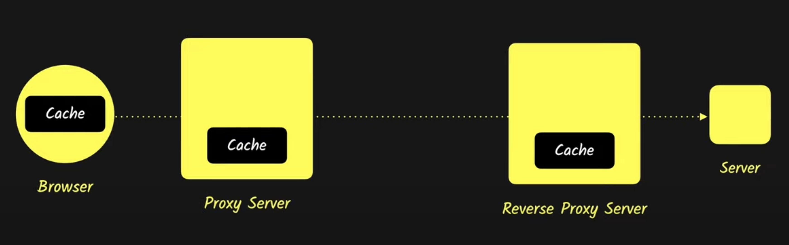

# Client Side Caching Techniques
- the cache at the client is used to store `expensive requests` which `do not need strong consistency` that are made to backend
- When a request is made to the backend server, if the server notifies the browser to cache the data, the data is persisted at the browser, and all the subsequent requests get the data from the browser cache instead of the backend server to `reduce latency` and `reduce the load on the server`
- the browser-cache serves the requests until the cache becomes stale (decided on the caching policy set by the backend). when the cache becomes stale, the next request is sent to the backend and data is persisted at the browser cache until the cache expires.
- this cycle is contiued, to reduce latency and ensure eventual consistency. for the applications which require high consistency we must think of innovative ways to `cache data`.
- the server responses can be cached at three levels, at the browser, proxy (provided by the org/ISP) and reverse proxy(setuo by server admins)

## Caching using the HTTP headers
- HTTP provides a few headers to `control the caching behavior` at the client(browser)
- Whenever, the server wants the client to cache the response, then the server sends the caching headers with the response. to notify all the intermediate machines and the client to cache the response
- the headers responsible for caching the data are (Expires and pragma are used for backwards comppatibility with HTTP/1)
    - `cache-control : ` can be set to private/public. `cache-control: Private` implies that the data is private to the user and the data will not be cached at the intermediate proxies, `cache-control: Public` implies that the response data can be cached at the proxies.
    - `cache-control : max-age={Time} : ` is used to set the expiry timer for the cache `s-max-age={Time}` (shared max age) is used to set the expiration at the proxy and client. we can use `max-age` and `s-max-age` together to have different expiration timers at the proxies and clients
    - 
- the headers responsible for validating the cache are
    - `Etag - Entity Tag : ` used to validate if the resource has changed at the origin server, after the expiration of the timer (Hash Digest of the data)
    - `Last Modified : `

## Caching strategies
1. Light Caching
2. Aggressive Caching

## Useful Links
- [HTTP Caching Video](https://www.youtube.com/watch?v=HiBDZgTNpXY)
- [Browser Caching Best Practices](https://www.youtube.com/watch?v=z4XdfFscxSk)