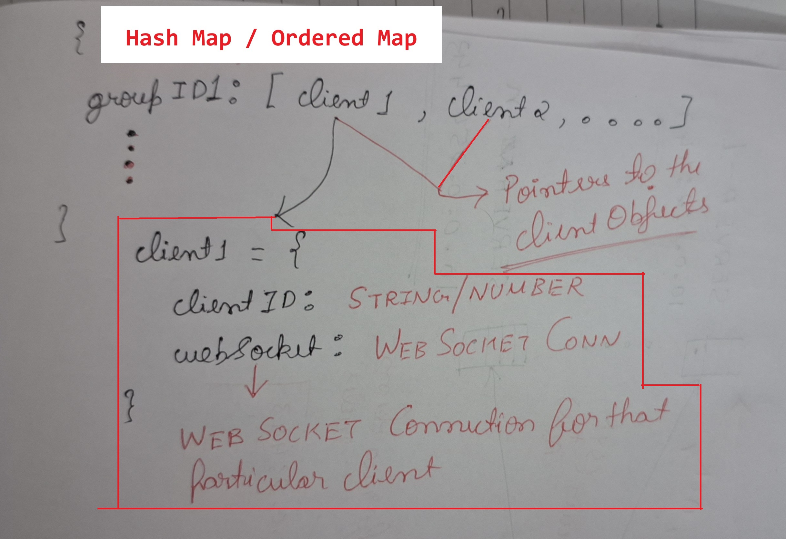
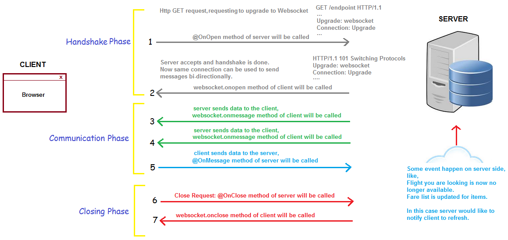

# Web sockets
### Basic Overview
- **Persistent, Bidirectional**, full duplex (both the server and client can send packets into the communication channel at the same time) communication **`over HTTP (uses TCP socket under the hood)`**
- Traditional HTTP request response cycle is dependent on the client polling the server (A hacky way of simulating push based communication is by using a long polling request)
- Long Polling Request: is a request with a long timeout duration, and the server keeps on sending data until the timer runs out or a new request comes from the client
- Long Polling cons : (**`Needs HTTP headers with each Packet, thus has a lot of unnecessary overhead, more over http infra doesn’t support fast paced real time communication`**)
- Web sockets use HTTP request response cycle for, establishing a persistent connection, once the connection is established, we use smaller web socket header
- Cons : all the proxies and firewalls in between the client and server must support Web sockets, and web socket doesn’t have the same caching and security as HTTP
- It is a stateful protocol, the hosts are aware of each other

## Web-socket handshake 

## Improving security (Masking)

`Sec-Websocket header`

### LLD (Establishing Web socket connection)
- Web-Sockets have 3 basic events, `onopen`, `onclose` and `onmessage` , we can attach our custom handlers to these events and handle them accordingly. following is an example of how we can handle each events
    - `onopen` : we might want to send an **`INIT message`** from the client as soon as the connection is opened, this message payload should contain the `clientID` . this message notifies that the client has connected to the web socket server (the request can also include a **`groupID/RoomID`** so that we can notify only the clients in the room/group), keep a data structure (HashMap/OrderedMap) so that we can efficiently query the groups for a client and send messages.
    

    
    

    - `onmessage`: we need to query the data-structure (which manages groups efficiently) and notify/send the message to all the clients in the group (using the WebSocket connection maintained by each client). In case there is no groups/rooms maintain a list of pointers to the connected client objects
    `Client = {clientID: STRING/NUMBER, webSocket: WEB_SOCKET_CONN}`

    - `onclose`: we should free up all the state about the client connection from the memory (delete the entry from the group data structure)

    

### Frame buffers and streams
- Web sockets break down http packets into frames
- `Read buffer : ` if the thread is busy with processing data, and is blocked, we can buffer the incoming frames, and read from the buffer when the thread gets unblocked
- `Write buffer : ` we can buffer the smaller frames to be sent over the websocket connection, and send them by grouping them together into one big frame, there by minimizing Round trips
- usually

### Scaling Web sockets horizontally

### how are web sockets handled by different programming paradigms
- We will be comparing 2 paradigms Single Threaded event-loop based (NodeJs), multi threaded (Go)

## Useful Links
- **Web Socket Reference :** [How Do Websockets Work? | Kevin Sookocheff](https://sookocheff.com/post/networking/how-do-websockets-work/)
- **Scaling Web sockets :** [How to scale WebSocket – horizontal scaling with WebSocket (tsh.io)](https://tsh.io/blog/how-to-scale-websocket/)