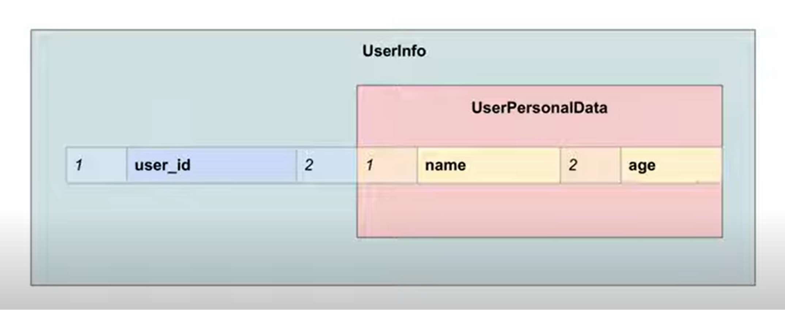

# gRPC (Remote Procedure Call)
- used for communication between internal apps/microservices (no browser support)

## Why gRPC
- `browser` by default has library APIs that let you use popular web protocols (http/websockets....)
- For most of the web-protocols, if we want to use it outside of the browser then we depend on the client libraries (SOAP client library/ HTTP client library )
- There will be multiple client libraries for each of the protocols
- Thus we are dependent on the people maintaining/updating the client library to update the library, when the Protocol has major revisons (http/1.1 -> http/2) or security pathces, or gets new update.
- If the libraries are not updated they become obsolete or will have major security vulnerabilities
- The server and the client will use different languages, there by use different client libraries to use the protocols for communication (which makes them dependent on the underlying implementation of the library)

- gRPC attempts to standardize the client libraries for the gRPC protocol, (online library for all the popular languages ), same library for clients and servers
- Protocol: the protocol is abstracted, it exposes an interface (a few methods to interact with the underlying protocol ), thus any web-protocol can be swapped in/out when using gRPC (currently grpc uses HTTP/2 under the hood)
- Message format:  Protocol buffers are like schemas (langauge agnostic -> can be used with any language)
- < how is it compiled to be language agnostic ? Serialization/Deserialization >

## gRPC modes
gRPC was created to be the one protocol which rules them all, thus it needs to do everything that HTTP,WEBSOCKETS, SSE and other protocols do.
- `Unary RPC` (request/response cycle)
- `Server Side Streaming`
    - make one request and get multiple responses/stream of responses
    - example : YouTube Streaming
- `Client Side Streaming` 
    - Stream of Messages / Multiple messages from client to server, and server sends one response
    - example : uploading a large files in chunks, 
- `Bidirectional Streaming` (full duplex like websockets )

## Protcol buffers
- method used to serialize structured data, (serialiation allows effecient transmission of the data over communication channel, and effecient storage of data on the disk)
- protoBuf serializes native objects into a stream of bytes (binaryStream)
- speciefies th order in which the members of a struct are stored

<div style="align-text:center;">

</div>

- `Services`
    - have the remote procedure declarations (parameters, return types)
- `Messages`
    - define the message structs

## using the services
### at the Server
- the methods in the services will take in a `call object`, which corresponds to the actual Remote Procedure call from the client, and a `CallBack function` that is used to send back the data to the clientt.
```JavaScript
callback(bytesWrittenByServer , byteBuffer){
    /**
     * Implementation to send a response back to the client 
     * to make it read the specified bytes from the byte buffer
     */
}

```
- whenever the server calls the `callback`, client gets a response and reads specified number of bytes from the byteBuffer  
- the `callback` implementation is done by the gRPC library, used to trigger send response

### at the Client


## gRPC Pros and Cons


### Cons
- Use of Schema (requires more work to set up stuff)
    - people moved from SOAP to REST, because REST had no schema, 
    - there was less work of coding schema, for each new resource.
    - On the internet there is no schema there's just a blob of HTML and Javascript
- Thick Client ()
- Proxies (all the proxies in between the client and server might not support GRPC, and the request may never end up reaching the server)
- No Native Browser support
    - each protobuf/schema is unique (think of it like defination of a new protocol)
    - thus each gRPC server implements its own schema (or protocol)
    - and browser can not support a random schema (or protocol)
- Error Handling 
    - Doesn't support HTTP error codes; we are essentially building our own protocol
    - Thus we need to implement our own error handling logic for the protocol
- Timeouts (Pubs/Subs)

## Useful Links
- [gRPC using TypeSscript](https://github.com/hnasr/javascript_playground/tree/master/grpc-demo)
- [how protocol buffers serialize data](https://www.youtube.com/watch?v=FR754e5xIwg)