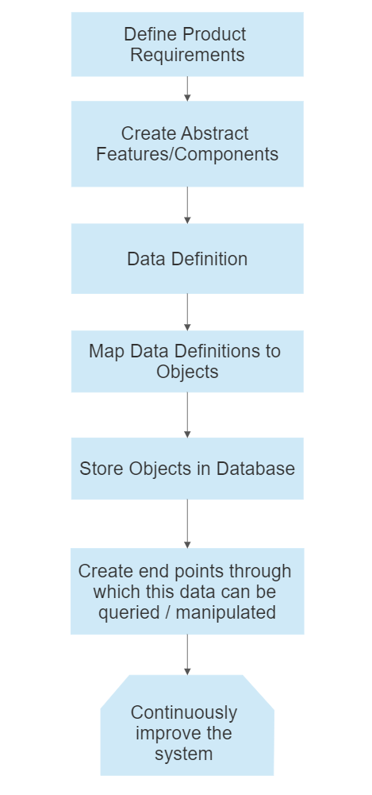
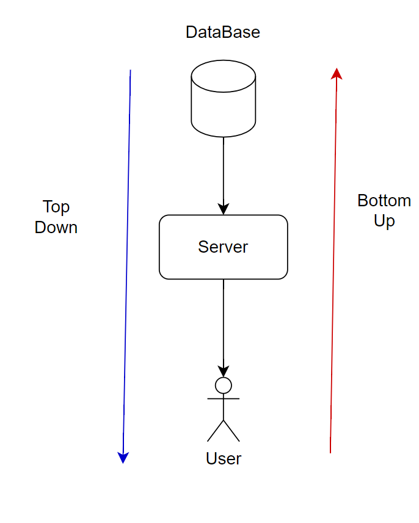

# High Level Design
- A large scale distributed system is a `highly complex and interconnected system` that is designed to handle data and compute-intensive processes, and can scale horizontally by adding more nodes to accommodate increasing demand or workload.
- Primary goal of such a system is to provide `high performance` (low latency), `fault tolerance` (manage failures), `consistency` (as data is distributed across nodes) and `reliability` (reduce down time), `Extensibility` (how easy is it to modify the system, reduce coupling), **Testing** (very important in real world scenario).

  
  
Flow for high-level design process

1. Define product requirements based on user feedback, and document them in a product requirement document.
2. Come up with abstract features/components based on the design document.
3. (Data Definition) Define the structure, format, and meaning of the data by considering its source, frequency, volume, and security requirements.
4. Map the data definitions to objects.
5. Store the objects in a database, build endpoints to access the data from the database,  and continuously improve the system by making corrections and updates to the design and implementation.
6. Testing the system and its extensibility

- The Api's(Back-end) we build must be independent from the client(Front-end)
The requirements are converted into ***Features***, based on the features we come up with the Data Definition which are then mapped to objects which will be stored in the database, after this we define endpoints from where this data can be accessed/manipulated.Write decoupled, scalable and extensible code

## Ways to approach system design problem
Two ways to approach a system design problem problem, think of all the data and services required in a particular part of the system and visualize the flow and modifications to the data as it passes to to the next, 
1. From customers to servers, and finally to database (bottom up) ***UserRequirements -> Define Apis -> Modelling the data which will be served by defined Apis***
2. From Database to server to customers (top down)
***modelling Data required to satisfy customer needs -> designing apis for the data -> Meeting user requirements***

  
  
System Design Approaches

- once the high level blue proint is done we can think about what are the actual tools we can use to make this system possible, we will be using System Design Patterns (Load Balancers, caches, etc) which are provided by cloud providers like tools, 
- its better to use already existing tools instead of building one from scratch as they are already heavyly tested.
- **Design Pattern :** Reusable solution to commonly occurring problem

## Basic system
- we will have some `business logic` (piece of code) that will be running at our `remote server`, we will allow users to use this piece of code.
- the code can be exposed over some protocol (HTTP, Websockets, WebRTC, gRPC etc.) using a api(application programming interface)
- to persist the `User Data`, we can use some DB (SQL/NO-SQL)
- to setup all this we can use a cloud service to manage everything at a single place (Maintainance and Reliability is taken care by the CSP)
- the System keeps changing as the requirements keep changing (user needs/scale)

## Low-Level Design
- We break down the, high level design into smaller chunks representing different functionalities, and code these chunks seperately and finally link them together to form the entire system 
- We take a bottom up approach to low level design
  1. What are the actions that user can perform ? (Use Case Diagram)
  2. 

### Useful Links
- [System Design Roadmap](https://takeuforward.org/system-design/complete-system-design-roadmap-with-videos-for-sdes/)