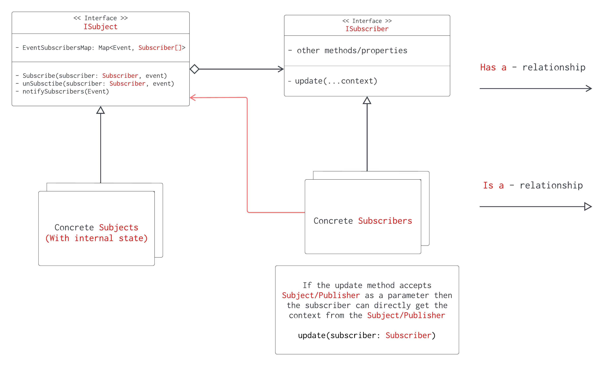

# Observer pattern
- There are 2 important classes here
    - A subscriber/observer class
    - A publisher/subject class
- The subscribers subscribe to an event at the publisher, the events are tied to the state change that happens at the subject/publisher
- When some state changes at the Publisher/Subject, it's the `publisher's responsibility to notify all the subscribers` that have subscribed to that particular event
    - The publisher maintains a map of the `events` and the corresponding `list of subscribers` (`Map<Event, Subscribe[]>`)
    - we can also maintain a list of callbacks that need to be called instead maintaining a list of subscribers (`Map<Event, Callbacks[]>`)
- Subscriber exposes a update function (which will be used to notify/update the subscriber about the event)
    - subscribers need some contextual information to handle the update correctly
    - if the subject/publisher knows what data to update at the subscriber object, then this data can be passed to the subscriber
    - to keep the function signature clean the `publisher can pass reference to self`, allowing the subscriber to pick only the data it needs from the subscriber `update(...params) / update(subscriber: Subscriber)`

## Problems that observer pattern addresses
- Subscribers can avoid `polling` an object at periodic intervals for state change (as the publisher is responsible for notifying all the subscribers)
- observer is event based, we can assign a `callback function` at the publisher that gets `called asynchronously by the publisher` when the event is triggered
- As the subscribers list is dynamic we can add and remove subscribers, this allows is to subscribe to events only for a short period of time
    - we need to `null out references` to the subscriber after the `lapse of subscription life time` is over or else we will end up causing a `memory leak`

    

### Relation with other patter
- we can combine the following patterns to gether to implement an `event based request/command handler`
    - Command : encapsulates every thing a request/command needs to execute
    - Chain of responsibility : finds the appropriate handler (publisher), and publisher notifies the observers
    - Observer : observers gets the event notification and updates its internal state 

### Few things to go through before going through the code example
- shared and exclusive locks
- C++ pointers
- C++ threads

