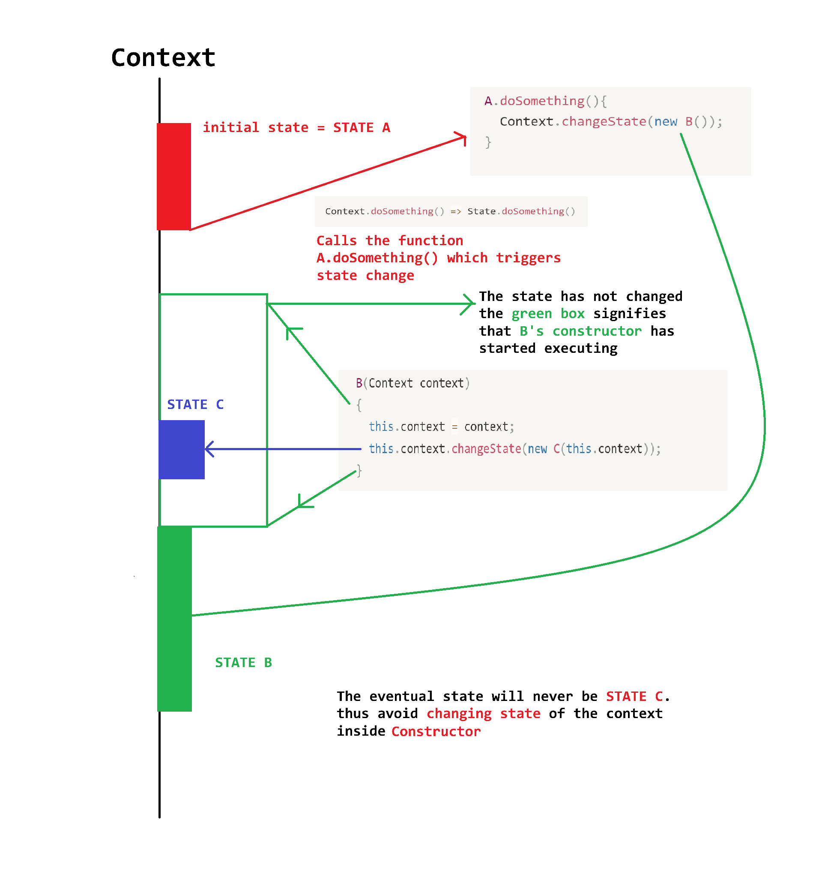

# Behavioural Patterns

## iterator pattern
- `Collection` : is a container for group of objects (Lists, Queues, Graphs, Trees, Matrices etc)
- The traversal of the container may contain complex logic (BFS/DFS), adding traversal algorithms might `blur` the responsibility of the collection (the primary responsibility of the collection is to optimally store/dispose the group of objects)

## Observer Pattern
- The fundamental idea for this, pattern comes from the fact that `push is better than poll` in case of `event notificaations`
- Rather than clients `continuously observing` for change in the state of a particular object, the object has a map of subscribers who have subscribed to certain events (state changes that happen in the object)
- for a given event `e`, The `Publisher Object` notifies all the clients subscribed to the event `e`
- < diagram showing push vs pull > 

## State Pattern

- The concrete state objects are responsible for transitioning into other states, they replace the `state object member` in the context class
- the transitionin happens through createing the new concrete state object followed by deleting self
- the state object member of the context class decides on the behaviour of the context class
- default constructor (with null context) is used to ensure that there is no deadlock between state and context
- The context class is responsible for managing the lifetime of the state objects
< Heuristics Image  >

### Changing State inside constructor
- do not change the state of the context inside constructor (look at the image below for the reasson)
    - example: assume that you have 3 states A,B,C
- The state will never change to the stateObject (`object of Class B in case of the above example`) being passed to the context inside the constructor, as at the end of the constructor call 
- The control moves back to the `calling function` and the, stateObject of the Context will belong to the Class whose constructor was called by the `calling function`
- the calling function in the above example is `A.doSomething`, and the constructor belongs to `class C` 
- in the C++ code example we have solved the issue (we want state change to happen after the `object construction` and previous set state ends)

### State Machines
- Systems that take decesions based on their current state/situation, and not based on how they got to the state (Does not care about past data)
- State Machines behave differently depending on what state they are in
- A State machine has 2 main components `State` and `Transitions`
- The system also has `behaviour/methods`
- whenever the `State` changes the `behaviour/implmentation` of the methods change  

### Example
- Consider a Metro Gate, You can perform 2 operations/methods, either `enterGate` or `makePayment`
- The Gate can be in one of the three states (`Open`, `Closed`, `Processing`)
- There are transitions Between the states these states as well (`makePayment`, `paymentOK`, `PaymentFailed`, `Enter`)

 < Example Image  >
### Class Diagram
- The System/Context has a IState (object with interface reference type), and all the concrete states implement/inherit the Abstract State (IState)
- Concrete State is a IState, Document has a IState
- To Transition to another state replace the current state object with another state object
- All the State Dependent methods are put in the Abstract State
< Class Diagram Image  >

- When implementing the state pattern in c++, only the initial state will have default constructor, (and a setter)
- `Future work :` We can model the payment timeout on a seperate thread, and cancel the processing if some one tries to enter in between processing

## Command Pattern
- encapsulate all the data about the request between sender and reciever, into a `standalone object`
- this allows to pass the requests as ?method arguments?, delay and queue them, this also makes it easy to support `undoable opeerations`
- main idea is seperation of concerns, The `UI layer` must solely be responsible for rendering GUI, and all the logic/calculations should be handled at the `logic layer`

