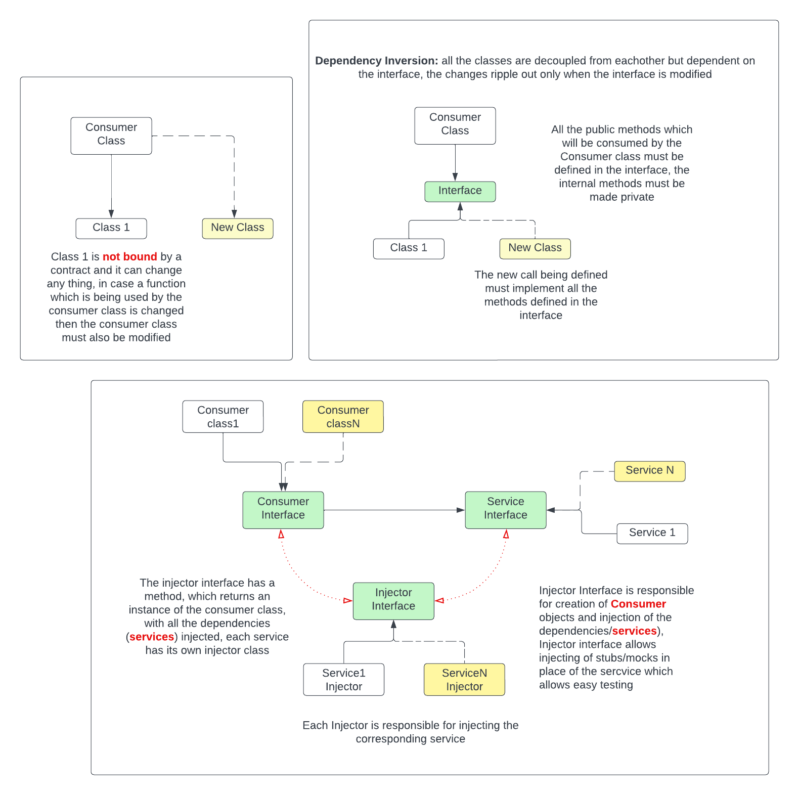
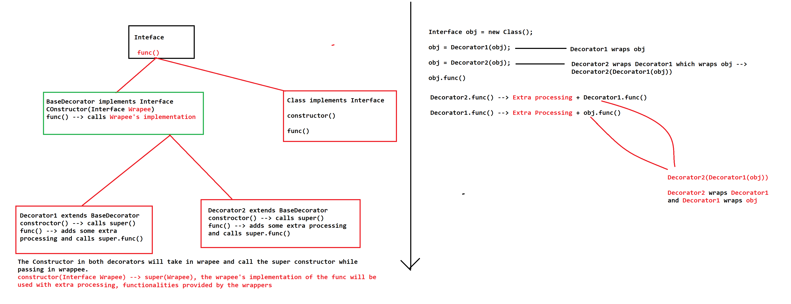

# Dependency Injection
- Dependency injection is a fancy term used, Passing the dependencies (objects), as constructor/function arguments. instead of creating them inside the constructor/functions. Helps making testing easiear by allowing injection of stubs/mocks, in web setting allows **asynchronous creation/ deferred loading** of the objects, also called lazy loading.
- the responsibility of creation and destruction ( lifetime/memory management) of the dependencies will reside with some other class ( Injector class / Factory )

## Concept refresher
- Class A is dependent on class B, when A uses/accesses one of the members of class B, or creates an instance of B
- We use Interfaces for dependency inversion, interfaces allow some standard methods that must be mandatorily implemented by the class that implement the interface, thus allowing access of all such class  through the interface ( Polymorphism )
- The creation and lifecycle management of the objects is usually done by factories ( as the creation involves complex logic and decreases the code quality if done at a single place )

## Example
In the following class the lifecycle/memory of the service objects is managed by the service injectors, the service injectors create instances of the consumer clas by passing the corrosponding services into the consumer class constructors.

From the above diagram we can infer that, whenever we want the consumer to consume a new feature we just have to create corresponding injector and service classes

# Decorator pattern

Decorator is basically a wrapper which implements the same interface as **Wrapee** (`the class being wrapped`), It implements the same functions declared by the constructor , but we can cascade multiple wrappers (Decorators), to add extra functionalities to the **Wrapee**,  when we want to use a function declared by the interface, we will make cascading calls to the function implementations of all the cascading wrappers

A decorator wraps around the object being passed and adds in extra functionality to that object.